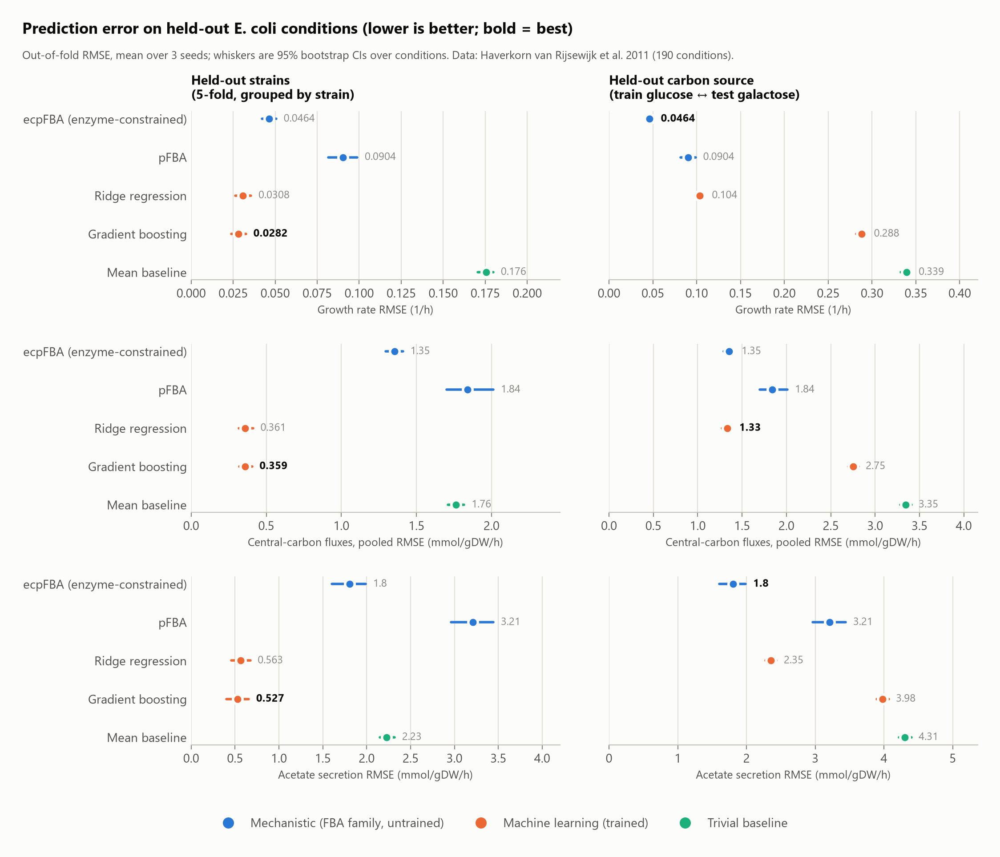
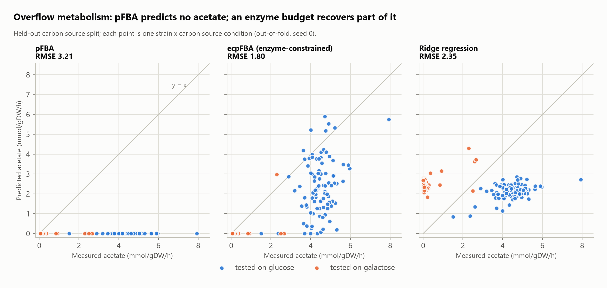
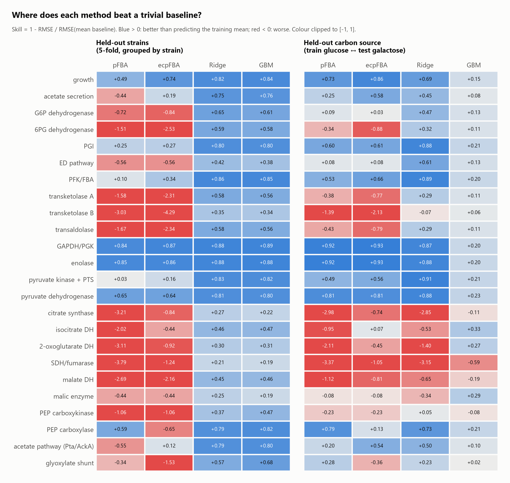
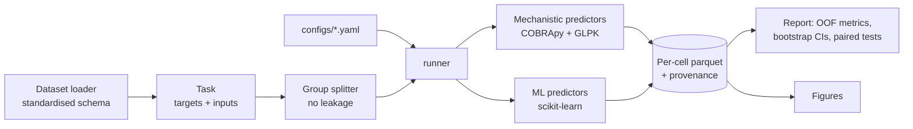

# MEFO: Mechanistic vs. Empirical Flux Outcomes

**When does machine learning beat constraint-based metabolic modelling, and when doesn't it?**

MEFO (pronounced "MEE-foh") is a reproducible benchmark that scores flux balance analysis (FBA) and its extensions
against machine-learning models on **held-out experimental measurements**, not on agreement with
FBA itself. It is built as a plug-in framework: a new solver, dataset, model or split is one file
plus one line of YAML. The long-term target is transfer to cyanobacteria (*Synechocystis*
PCC 6803, *Synechococcus elongatus*), where flux data are scarce and mechanistic priors matter
most.

> **Status (October 2026):** the first full experiment cycle is complete on 190 *E. coli*
> conditions (95 strains × 2 carbon sources) with 13C-derived fluxes. Eight predictors, two
> leakage-safe split designs, three seeds, bootstrap CIs and Holm-corrected paired tests.
> 96 automated tests pass.

---

## Key findings

<picture>
  <source media="(prefers-color-scheme: dark)" srcset="docs/figures/fig1_headline-dark.png">
  
</picture>

1. **An enzyme budget halves FBA's error.** Adding a single total-enzyme constraint
   (ECMpy/sMOMENT-style, published parameters, *nothing fitted to this data*) reduces the
   growth-rate RMSE from 0.090 to 0.046 h⁻¹ and acetate error from 3.21 to 1.81 mmol gDW⁻¹ h⁻¹.
   It beats pFBA on 11 of 25 targets and is worse on 2 (Holm-corrected paired bootstrap).
2. **When asked to extrapolate, mechanistic models win.** Trained on one carbon source and
   tested on the other, enzyme-constrained pFBA has the lowest growth and acetate error of any
   method. It is statistically tied with ridge regression on pooled fluxes (1.35 vs 1.33).
   Gradient boosting fails outright: trees cannot extrapolate beyond the training range.
3. **Within the training distribution, ML wins, but less than it first appears.** On held-out
   strains, ridge and GBM have 3–5× lower flux error than any FBA variant. Within a single
   carbon source, however, their median R² over fluxes is only 0.09–0.19 (glucose) and ~0.45
   (galactose). They capture uptake-driven scaling, not the mutant-specific rewiring of the
   TCA cycle and pentose-phosphate pathway (see *Caveats*).

Together these suggest a **hybrid hypothesis**: mechanistic structure carries over to new
conditions, while ML corrects systematic within-distribution bias. Testing it is milestone M3.

### Overflow metabolism, explicitly

<picture>
  <source media="(prefers-color-scheme: dark)" srcset="docs/figures/fig2_overflow-dark.png">
  
</picture>

Aerobic *E. coli* secretes acetate on glucose. Classical (p)FBA cannot reproduce this: every
prediction is 0. The enzyme budget makes the low-yield, low-protein-cost fermentative route
optimal at high uptake. It recovers overflow on glucose and predicts essentially none on
galactose, where little is measured, but strain-to-strain scatter remains large.

### Where each method has skill, flux by flux

<picture>
  <source media="(prefers-color-scheme: dark)" srcset="docs/figures/fig3_skill-dark.png">
  
</picture>

Skill = 1 − RMSE / RMSE(mean baseline). The FBA family is excellent on lower glycolysis
(GAPDH/PGK and enolase: skill > 0.8 in both splits) but **worse than the trivial baseline** on most
TCA-cycle and oxidative-PPP fluxes. These are the reactions where regulation, rather than
stoichiometry, sets the flux. In the carbon-source split the baseline is the other carbon source's
mean, which is a weak reference, so skill there is inflated for every method.

---

## Caveats (read before citing any number)

- **The flux "measurements" are estimates.** They come from FiatFlux: 13C flux ratios plus
  measured uptake and secretion, fitted to a 25-reaction model. Every predictor receives the
  measured uptake rate (FBA as a bound, ML as a feature), so part of ML's within-distribution
  advantage reflects how the targets were constructed.
- **Only 3 of the 94 deleted genes exist in iML1515** (pgi, zwf, sdhC). For the 91 regulator
  knockouts, FBA can distinguish strains only through their uptake rates.
- **The transfer test has two carbon sources.** "Held-out carbon source" means two folds. More
  carbon sources are needed before generalising.
- **One dataset, one lab, one protocol.** These are first results, not conclusions.

A running log of results and their limitations is in [docs/findings.md](docs/findings.md).

---

## What is compared

| Family | Predictor | Description |
|---|---|---|
| Mechanistic | `fba` | Maximise biomass on iML1515 with the condition's measured uptake |
| | `pfba` | Parsimonious FBA: optimal growth, then minimal total flux |
| | `fva_summary` | Midpoint of each target's feasible range at optimal growth (half-range reported as uncertainty) |
| | `ecfba`, `ecpfba` | Total-enzyme-budget constraint Σ v·MW/kcat ≤ 0.227 g gDW⁻¹ with ECMpy's calibrated parameters; verified equal to ECMpy's own model (≤ 1e-6) and to its published growth rate (0.6802 h⁻¹) |
| Machine learning | `ridge` | Standardised ridge regression per target |
| | `gbm` | Histogram gradient boosting per target |
| Baseline | `mean` | Training-set mean per target |

No method is hyperparameter-tuned, so ML is not given more tuning effort than FBA.

**Data.** Haverkorn van Rijsewijk *et al.* (2011): *E. coli* BW25113 and 94 single-gene Keio
deletions on glucose and galactose. Targets are growth, acetate secretion and 22
central-carbon fluxes (mmol gDW⁻¹ h⁻¹). Provenance, units, mapping to iML1515 reactions and
licence are in [docs/dataset_notes.md](docs/dataset_notes.md).

**Evaluation.**

- **Splits:** only by group, never by row; the leakage tests cover every splitter.
  - *Held-out strains:* 5-fold, grouped by strain, so both carbon sources of a strain are
    held out together.
  - *Held-out carbon source:* leave one carbon source out.
- **Metrics:** computed on pooled out-of-fold predictions and averaged over 3 seeds. 95% CIs
  come from bootstrapping conditions (identical resamples for every method).
- **Comparisons:** paired bootstrap tests against pFBA, Holm-corrected across all 175
  comparisons.
- **Validity:** the mass-balance violation ‖S·v‖ is reported for every method that returns a
  flux vector.

---

## How it works



Every result row records the config hash, data hash, seed, solver, library versions and git SHA.
Cells are cached and the runner resumes after interruption. Failed cells are recorded as
results, not dropped.

```
metabench/
  core/        registry, interfaces, config, runner, results
  metabolic/   model loading, media, knockouts, enzyme constraint, toy network
  predictors/  fba/ (fba, pfba, fva, ecfba)   ml/ (mean, ridge, gbm)
  datasets/    haverkorn2011, toy
  splits/      leave-group-out, grouped k-fold
  metrics/     regression, classification, mechanistic validity
  analysis/    report and figures
configs/       experiment YAMLs
docs/          dataset notes, model notes, findings log, figures
tests/         96 tests (leakage, analytic toy network, model equivalence, ...)
```

Adding a predictor takes one file:

```python
@register_predictor("my_method")
class MyMethod(Predictor):
    def fit(self, train: TaskData) -> None: ...
    def predict(self, test: TaskData) -> Predictions: ...
```

It is picked up automatically, and the contract test checks its outputs' shape and units.

---

## Reproduce

Requires Python ≥ 3.11 and [uv](https://docs.astral.sh/uv/). No commercial solver is needed
(GLPK).

```bash
uv sync
uv run python scripts/download_data.py --model iML1515 --dataset haverkorn2011 --enzyme ecmpy_iML1515
uv run metabench run configs/ss_flux_haverkorn_strain_out.yaml
uv run metabench run configs/ss_flux_haverkorn_carbon_out.yaml
uv run metabench report ss_flux_haverkorn_strain_out
uv run metabench report ss_flux_haverkorn_carbon_out
uv run metabench figures            # regenerates docs/figures/ from stored results
uv run pytest && uv run pytest -m slow
```

All downloads are checksum-verified (`data/checksums.json`). Each experiment takes roughly
5–15 minutes on a laptop (mechanistic solutions are cached per condition); the Europe PMC
download of the dataset can take ~10 minutes.

---

## Roadmap

| Milestone | Scope | Status |
|---|---|---|
| M0 | Plug-in framework, runner, provenance, analytic toy network | Done |
| M1 | FBA, pFBA, FVA, enzyme-constrained FBA on iML1515 | Done (essentiality validation pending) |
| M2 | First verified flux dataset + baselines + report | Done |
| M3 | MLP, GNN and neural-mechanistic hybrid (NN → constraints → LP) | Next |
| M4 | Gene-essentiality task, second dataset | Planned |
| M5 | **Cyanobacteria transfer** (*Synechocystis*, *S. elongatus*) | Planned |
| M6+ | Surrogate speed, dFBA (diurnal), community FBA, strain design | Planned |

---

## References

- Haverkorn van Rijsewijk BRB, Nanchen A, Nallet S, Kleijn RJ, Sauer U (2011). Large-scale
  13C-flux analysis reveals distinct transcriptional control of respiratory and fermentative
  metabolism in *Escherichia coli*. *Mol Syst Biol* 7:477. doi:10.1038/msb.2011.9
- Monk JM *et al.* (2017). iML1515, a knowledgebase that computes *Escherichia coli* traits.
  *Nat Biotechnol* 35:904–908. doi:10.1038/nbt.3956
- Mao Z *et al.* (2022). ECMpy, a simplified workflow for constructing enzymatic constrained
  metabolic network model. *Biomolecules* 12:65. doi:10.3390/biom12010065
- Heckmann D *et al.* (2018). Machine learning applied to enzyme turnover numbers reveals protein
  structural correlates and improves metabolic models. *Nat Commun* 9.
  doi:10.1038/s41467-018-07652-6
- Ebrahim A, Lerman JA, Palsson BO, Hyduke DR (2013). COBRApy: COnstraints-Based Reconstruction
  and Analysis for Python. *BMC Syst Biol* 7:74. doi:10.1186/1752-0509-7-74

**Licences of inputs.** Dataset: CC BY-NC-SA 3.0. ECMpy parameters: MIT + Commons Clause
(non-commercial). Raw data are downloaded, not redistributed.

---

<sub>Development notes: on Windows inside OneDrive, keep `.venv/`, `data/` and `results/` out of
sync, or set `UV_PROJECT_ENVIRONMENT` to a path outside the synced folder. The first run after
installing touches many new files and can be slow. Parsed SBML models are cached in
`data/cache/`, keyed by file hash.</sub>
